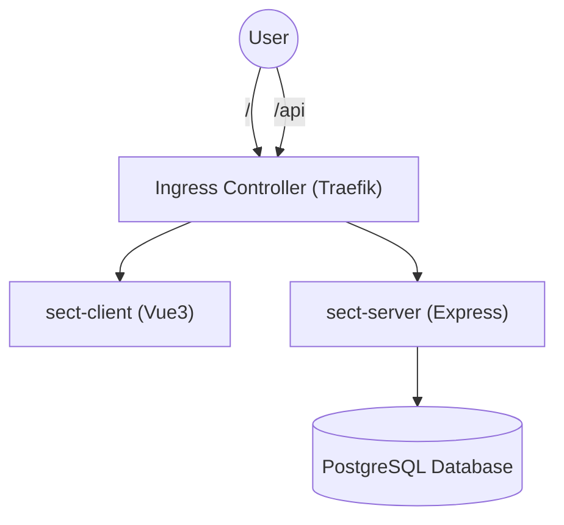
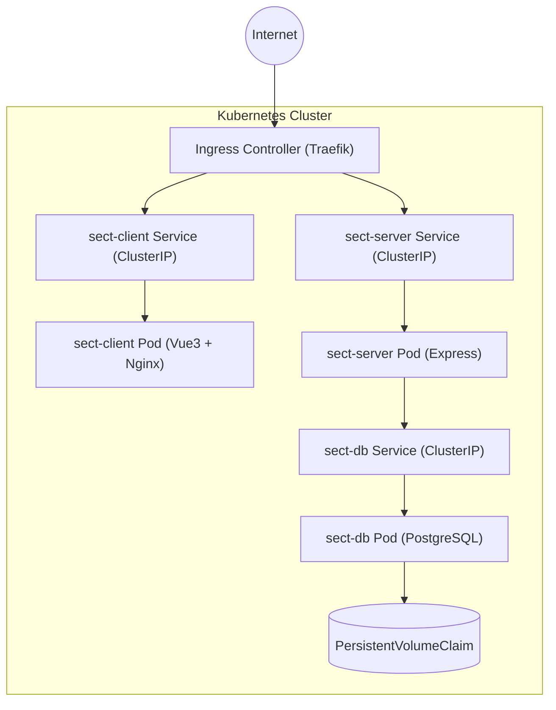

# Example Kubernetes


## Project Overview

This project was built as a Kubernetes showcase to demonstrate a solid understanding of core concepts by deploying a minimal fullstack application consisting of a client, server, and database.

All container images are hosted on Docker Hub and manually deployed using raw Kubernetes manifests, with no Helm or CI/CD pipelines yet, to highlight fundamentals such as Deployment, Service, ConfigMap, Secret, PersistentVolumeClaim (PVC), VolumeMount, and Ingress with TLS via Traefik.

## Architecture Diagram

### 1. External Routing Overview



### 2. Internal Cluster Architecture



## Tech Stack

| Layer              | Technology                  |
| ------------------ | --------------------------- |
| Frontend           | Vue 3 + Vite + Tailwind CSS |
| Backend            | Node.js (Express)           |
| Database           | PostgreSQL                  |
| Containerization   | Docker                      |
| Orchestration      | Kubernetes (k3s)            |
| Ingress Controller | Traefik (default in k3s)    |
| Image Registry     | Docker Hub                  |

## Configuration Techniques

This project uses two distinct configuration strategies:

- Docker Compose for local development
- Kubernetes manifests for production-like deployment

---

### Docker Compose (Local Development)

- Environment variables injected via `environment` blocks.
- Named volumes used for database persistence.
- Dynamic frontend configuration via direct volume mount of `env.js`.

---

### Kubernetes (Production Deployment)

- Configurations managed via `ConfigMap` and `Secret`.
- Persistent storage managed via `PersistentVolumeClaim` (PVC).
- Frontend environment settings injected dynamically via `volumeMount`.

---

## Per-Component Configuration

### 1. Database (sect_database)

**Docker Compose**

- Injects `POSTGRES_DB`, `POSTGRES_USER`, and `POSTGRES_PASSWORD` directly using the environment block.
- Mounts the `init.sql` script into `/docker-entrypoint-initdb.d/` for automatic schema creation.
- Persists database files using the named volume `sect_pgdata`.

**Kubernetes**

- Environment variables for the Postgres container (`POSTGRES_DB`, `POSTGRES_USER`, `POSTGRES_PASSWORD`) are provided via [`configmap.yaml`](k8s/db/configmap.yaml).
- [`init-configmap.yaml`](k8s/db/init-configmap.yaml) stores the SQL initialization script (`init.sql`) as a `ConfigMap`.
- The SQL script is mounted into `/docker-entrypoint-initdb.d/` using a volume mount (defined in [`deployment.yaml`](k8s/db/deployment.yaml)).
- Persistent storage is handled via a `PersistentVolumeClaim` (PVC) defined in [`pvc.yaml`](k8s/db/pvc.yaml).
- The database is exposed internally within the cluster via [`service.yaml`](k8s/db/service.yaml).

---

### 2. Backend (sect_server)

**Docker Compose**

- Uses the image `thitiphum12/sect-server:latest`.
- Injects environment variables (`PORT`, `DB_ON_FLAG`, `DB_URL`) via the `environment` block.
- Depends on `sect_database` to ensure the database is ready before the server starts.

**Kubernetes**

- [`configmap.yaml`](k8s/server/configmap.yaml) defines environment variables for the backend (`PORT`, `DB_ON_FLAG`, `DB_URL`).
- Environment variables are injected into the container using `envFrom: configMapRef` (configured in [`deployment.yaml`](k8s/server/deployment.yaml)).
- The backend service (`sect-server`) is exposed internally via a `ClusterIP` Service (defined in [`service.yaml`](k8s/server/service.yaml)).
- External access is provided through the Traefik Ingress Controller at the `/api` path (configured in [`ingress.yaml`](k8s/ingress.yaml)).

---

### 3. Frontend (sect_client)

**Docker Compose**

- Uses the image `thitiphum12/sect-client:latest`.
- Dynamically injects runtime environment settings by mounting `envs/client-env.js` into the Nginx server at `/usr/share/nginx/html/env.js`.
- This allows changing environment variables without rebuilding the frontend image.
- Depends on `sect_server` to ensure the backend API is ready.

**Kubernetes**

- [`env-configmap.yaml`](k8s/client/env-configmap.yaml) defines the dynamic frontend environment settings (`env.js`) as a `ConfigMap`.
- `volumeMount` (defined in [`deployment.yaml`](k8s/client/deployment.yaml)) is used to mount the `env.js` from the ConfigMap into `/usr/share/nginx/html/env.js` inside the container using a `subPath`.
- The frontend service (`sect-client`) is exposed internally via a `ClusterIP` Service (defined in [`service.yaml`](k8s/client/service.yaml)).
- External access is provided through the Traefik Ingress Controller at the root `/` path (configured in [`ingress.yaml`](k8s/ingress.yaml)).

---

## Folder Structure

The project is organized into two main parts:

- `k8s/`: Contains all Kubernetes manifests used to deploy the app.

  - `client/`: Frontend Deployment, Service, and ConfigMap
  - `server/`: Backend Deployment, Service, and ConfigMap
  - `db/`: PostgreSQL Deployment, Service, PVC, and init script ConfigMap
  - Also includes `ingress.yaml` and `namespace.yaml` for routing and namespace setup.

- `src/`: Contains the application source code and local development setup.
  - `client/`: Vue 3 frontend built with Vite and Tailwind CSS
  - `server/`: Node.js (Express) backend
  - `db/`: Database initialization script (`init.sql`)
  - `envs/`: Runtime environment config for frontend
  - `docker-compose.yml`: Local development orchestration file

## Deployment Instructions

Follow the steps below to deploy the project into your Kubernetes cluster:

1. Create the namespace

   ```bash
   kubectl apply -f k8s/namespace.yaml
   ```

2. Deploy the database

   ```bash
   kubectl apply -f k8s/db/
   ```

3. Deploy the backend server

   ```bash
   kubectl apply -f k8s/server/
   ```

4. Deploy the frontend client

   ```bash
   kubectl apply -f k8s/client/
   ```

5. Deploy the Ingress resource
   ```bash
   kubectl apply -f k8s/ingress.yaml
   ```

> **Important Notes:**
>
> - This project requires an Ingress Controller to handle routing.
>   If you are using k3s, Traefik is installed by default, enabling HTTP routing via Ingress resources.
>
> - If no Ingress Controller is installed in your cluster, you must expose services using `NodePort` instead:
>
>   1. In the Service manifests (`k8s/client/service.yaml` and `k8s/server/service.yaml`),
>      uncomment the `type: NodePort` and `nodePort` fields.
>
>   2. Update the backend URL inside the frontend ConfigMap (`k8s/client/env-configmap.yaml`)
>      to point directly to the backend NodePort service (e.g., `http://your-server-ip:30001`).
>
> ---
>
> - The TLS (`https`) section in the Ingress manifest (`k8s/ingress.yaml`) is commented out,
>   because Traefik requires additional ACME configuration to automatically issue certificates via Let's Encrypt.
>
> - Remember to replace `host` in the Ingress manifest with your actual domain before deploying.

## Ingress Routing

The Ingress controller is configured to route incoming traffic based on the URL path:

| Path   | Target Service |
| :----- | :------------- |
| `/`    | sect-client    |
| `/api` | sect-server    |

> All backend API routes are designed to be prefixed with `/api` directly within the server application (e.g., `/api/sects`).
> This ensures clean routing without the need for path rewrites in the Ingress controller.

## Feature Highlights

- Designed with a clear separation between infrastructure and application code.
- Dynamic frontend environment injection without rebuilding Docker images.
- Basic persistent storage setup for PostgreSQL using PVCs.
- Ingress routing configured cleanly without requiring complex rewrites.
- Simple, manual Kubernetes deployment to focus on core concepts.
